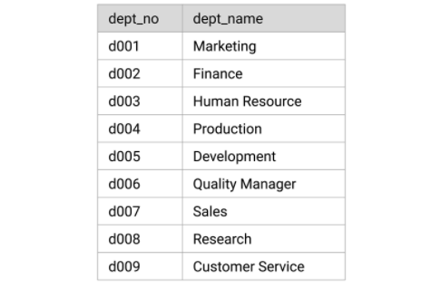
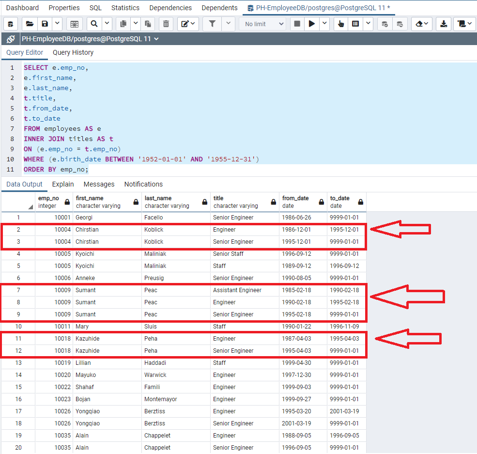
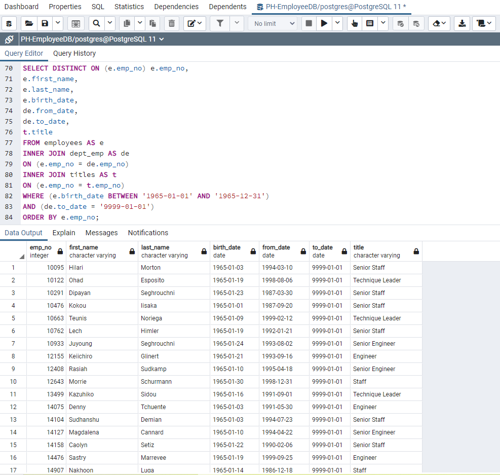
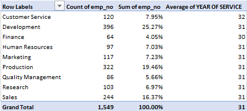

# Pewlett-Hackard-Analysis

**Background**  
Bobby's manager has given both of you two more assignments: determine the number of retiring employees per title and identify employees who are eligible to participate in a mentorship program. Pewlett-Hackard would like to launch a new mentoring program with employees eligible to retire in the near future. Instead of having a large chunk of their workforce retiring, they want to introduce a mentoring program: experienced and successful employees stepping back into a part-time role instead of retiring completely. Then, summarizes your analysis in order to help  Bobby’s manager prepare for the “silver tsunami” as many current employees reach retirement age.  Since Pewlett-Hackard has no real database or data management system in place, understanding the data we are working with and finding the connections within is a huge step.  
**Overview of the Analysis**  
Our first assignment is to create a Retirement Titles table that contain all the titles of current employees who were born between January 1, 1952 and December 31, 1955. Some employees have had multiple titles in the database—for example, due to promotions—we will need to create a table that contains the most recent title of each employee. Then, we will create a final table that has the number of retirement-age employees by most recent job title.  
The second leg of our assignment will be to create a mentorship-eligibility table that holds the current employees who were born between January 1, 1965 and December 31, 1965.  The current employee pool will be extracted from the nine departments that Pewlett-Hackard allocates their employees in respectively.  
  
**Results**  
•	**Employees Eligible for Retirement**  
The first major point we can draw from the Retiring Titles report we created is that 30% of the employees are eligible for retirement.  That is an astounding number to digest as well as plan an effective succession plan.   
[Retiring_Titles](https://github.com/whitneyshine/Pewlett-Hackard-Analysis/blob/main/Data/retiring_titles.csv)  
What the data also tells us is that 64% of the Retiring Titles are comprised of Senior Level Employees and if we look at it from the big picture of Pewlett-Hackard, that is total represents 19% of their current workforce.  
•	**Years of Service with Pewlett-Hackard**  
There are duplicate entries for some employees because they have switched titles over the years.  With the Unique Titles table we created, I believe we left off some valuable information that management would love to digest.  The main objective in presenting this analysis is to create a correct lens of data that the intended audience needs to view.  When we eliminate the dates that show the eligible retiring employee and held all their unique positions, we are not thoughtfully planning for the impact that Pewlett-Hackard will endure since we have minimized the total years of service given by each retirement eligible employee.  For example, Sumant Peac has had an extraordinarily successful career at Pewlett-Hackard based on his two promotions and 36 years of service.  We lose this analysis in the Unique Titles table because we altered the true line of progression of how the employees career began as an Assistant Engineer, promoted to Engineer, and will commence as a Senior Engineer.  If we look at the criteria of the Unique Titles query, we wanted to retrieve the most recent title and because of that simple enhancement, we skew the data regarding what we are truly losing regarding Pewlett-Hackard institutional knowledge.  The amended data tells us we are just losing a Senior Engineer but in truth, we are losing what we are trying to create or maintain in our Mentorship Eligibility report.  I would stand to say that we need to reevaluate our criteria as Sumant Peac is certainly an employee who has earned their eligibility for retirement but one we would like, and need, to serve as a mentor for our next generation of employees.  
  
•	**Employees eligible for Mentorship**  
A major point we can draw from the Mentorship Eligibility table we created is that 1% of our employees are identified in the mentorship eligibility query – or put another way, a total of 1,549 employees.  That is an exciting number to see as we plan to launch of Mentorship Program.  What the data does tells us is that 45% of the eligible Mentors have Senior in their titles.  The bright side of having such a small sample size but filled with senior level expertise is that the mentorship process can be more in-depth since this is going to be a critical and crucial implementation. More than likely, we have identified most of the employees who will mature into the agents of change and future leaders within the Pewlett-Hackard organization.  
  
•	**Departments with the most eligible for Mentorship**  
As we enter the phase of implementation for the mentorship program, one of the most important aspects we need to consider in our recommendation is how are we going to launch this program efficiently and effectively.  This table brings to light an interesting approach since we need to analyze our data to chart our productive course forward.  I wanted to see from our Mentorship Eligibility report what departments contained the most employees eligible for mentorship as well as from what departments contained the least amount of eligible employees.  This tells us for the departments that contain a high concentration of eligible employees, we should highly consider a team’s approach that involves a trickle-down approach training style.  In this approach, the highest tenured employees can work together to develop a best approach method and then eventually work as a team to bring the next employment generation up to their level of expertise by the time their retirement date vest.  For departments that are smaller in size is when you need to focus the help of not only the department experts but also Human Resources as well as consider retaining more retirement eligible employees that are centers of influence and experts.  The departments with lower levels of expertise will need a higher level of resources and time concentration during the initial mentorship.  
  
**Summary**   
•	How many roles will need to be filled as the "silver tsunami" begins to make an impact?  
There will be total of 90,398 roles that could need to be filled.  One of the most important things to remember is that we created a report to analyze and we may need to consider enticing or incentivise a particular set of qualified retirement ready employees to stagger their retirement dates so that the "silver tsunami" is not a direct and unstainable impact to Pewlett-Hackard.  
•	Are there enough qualified, retirement-ready employees in the departments to mentor the next generation of Pewlett-Hackard employees?  
The definition of mentorship is the influence, guidance, or direction given by a mentor. In an organizational setting, a mentor influences the personal and professional growth of a mentee.  Yes, based on our queries we have more than enough qualified, retirment-ready employees to mentor the next generation of Pewlett-Hackard employess.  If we have a round number of 90K retirement ready employees and 1500-ish employees that are eligible for the mentorship program, that is a 60 to 1 ratio, which is something to be excited about as Pewlett-Hackard.   
Two additonal queries that I would look to create would be centered around "positions held" analysis as well as how much we are paying our two bucketed groups of employees.  
Expertise is critical to understand as well as critical for an organization to be successful.  Understanding the departments and how the employee has earned promotions tell us a story about the employee in regards to how well they communicate within the organization and how much the continue to grow within Pewlett-Hackard.  Seeing that one employee has worked their way up the corporate ladder is an employee that has earned the right to be considered for the mentorship as well as it highlighting their potential to be one of the next leaders in Pewlett-Hackard.  The main reason employees leave their jobs is from a lack of career growth in their current position. Combine this with the talent shortage and leaders are faced with an expensive recruitment challenge. Retaining top talent has to become a top priority for Pewlett-Hackard because replacing them is increasingly difficult coupled with 30% of the employee base is retirement eligible.     
To analyze and understand the salaries of the retiring employees will help you understand the financial committment you will be need to make for retaining and promoting your mentorship eligible employees as well as being able to increase departmental training within the department via Human Resources or if the data leads us to launching a hiring campaign to onboard the necessary employees to withstand the "silver tsunami".

Pewlett-Hackard has fallen behind in the database department, so it will be a huge achievement to get personnel data organized for the company.  They are using their leading indicator data as a lagging indicator and it is paramount that they implement an HR software that houses professional certifications as well as industry training that the employee has attended and earned proper credit to properly manage future retirement dates.   Also, Pewlett-Hackard should created their own internal trainings or certifications that are geared towards their industry specialties as well as establish an in-house HR training that they are required to take as they gravitate towards becoming leaders or senior staff in their careers.  Data integrity is the quality of the data we are working with and that also needs to be applied to their employee data to maximize their return on investments as a company since their employees are their greatest investments. Clean data will yield better results during their analysis and maintaining the data integrity ensures greater accuracy, reliability, and highest return on the employee investment. With that being said, I recommend implement Workday as their source of truth for when it comes to employee and employment data.  Workday will significantly improve HR and Payroll compliance, reduce risk, provide better data for decision making, and increase efficiencies across the institution. It will also enable employees to work more efficiently by having consistent, streamlined, and modern practices.  I have attached the five benefits of using Workday here in the Pewlett-Hackard [WORKDAY](https://www.workday.com/en-us/pages/infostudy-bredin-fast-track-to-growth-hr.html) recommendation.
